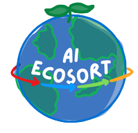

# 🌍 EcoSortAI

  
*Logo created using Canva, featuring four arrows — each representing one of the material classes: Cardboard, Metal, Paper, and Plastic.*

EcoSortAI is a smart recycling assistant that helps users detect recyclable materials, track their waste habits, and earn points they can redeem for cool rewards.

---

## 📊 EcoSort's Overview

Displays a bar graph showing how often each material — Cardboard, Metal, Paper, and Plastic — was detected in a given month.  
This helps users visualize which recyclables they interact with most frequently.

---

## 📈 Waste Tracking

Shows a line graph of total credits earned over time based on material detection.  
Below the graph, there’s a table listing:
- The time each material was detected
- The number of points added for that detection

Points are awarded as follows:
- Cardboard: +7  
- Metal: +10  
- Paper: +5  
- Plastic: +3

---

## 🎥 Material Recognition

Activates the user’s webcam to detect materials live using AI.  
Detected materials are displayed below the video with their names and logged into a table for tracking.

---

## 🏆 EcoPoints Redemption

Users can spend their earned points by choosing one of four avatars:
- Balance Seeker  
- Earth Guardian  
- Metal Titan  
- Water Spirit  

Each avatar unlocks different rewards based on your eco-performance.

---

## ⚙️ How to Run

1. Locally (through Jupyter LaB

---

## Thank you for visiting! ⭐
- This project was done for one of my classes!

